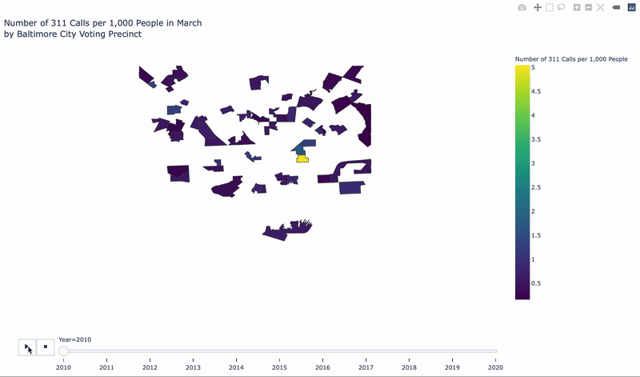

# Geospatial Analysis for Baltimore City-Specific Shapefiles

Several articles have recently highlighted to how the COVID-19 outbreak might affect the 2020 US election because of [postponed primaries](https://www.nytimes.com/article/2020-campaign-primary-calendar-coronavirus.html), [halted election rallies](https://www.npr.org/2020/04/02/825800521/how-the-covid-19-outbreak-is-affecting-the-presidential-campaign), and [general anxiety related to the virus](https://hub.jhu.edu/2020/04/16/covid-19-2020-presidential-election-democratic-primary/). We've already seen and looked at metrics that could help support local leadership in regards to US county-level findings, but how do trends differ within a county or county-equivalent and what might this be able to tell us about changes in civic engagement? 

We'll look at Baltimore City 311 Call open data to estimate civic engagement in Baltimore City over time. [311 is a non-emergency phone number that people can call in many cities to find information about services, make complaints, or report problems like graffiti or road damage](https://www.govtech.com/dc/articles/What-is-311.html). Baltimore City's [311 service](https://balt311.baltimorecity.gov/citizen/servicetypes) operates through phone calls, website requests, and mobiles requests externally for citizens and internally for city departments who need to log service work \(e.g. if they see a pothole in an area where they are cutting down overgrown shrubs\). 

Because the 311 service is a completely voluntary, crowdsourced process, the 311 Service Requests from citizens can give us an estimate for which areas in Baltimore have higher and lower civic engagement. This might help us: 

* Estimate any changes in voter engagement for the 2020 Election
* Develop proactive strategies to encourage more people to vote in the 2020 Primary and General elections 
* Identify and help communities that might be struggling during the COVID-19 pandemic

among other points, if the COVID-19 outbreak continues into election season.  

### Business Question

How might the 2020 Primary and General Election turnout be affected due to the COVID-19 outbreak?

### Data Question

We'll use Baltimore City 311 call counts to estimate civic engagement in voting precincts over several years in both general line graphs and choropleth maps. 

We'll use data from: 

* [Baltimore City Open Data ](https://data.baltimorecity.gov/City-Services/311-Customer-Service-Requests/9agw-sxsr)\(311 Customer Service Requests\)
* [Maryland State Department of Planning](https://planning.maryland.gov/Redistricting/Pages/2010/precinct.aspx) \(voting precinct populations\)
* [Election Geodata](https://github.com/nvkelso/election-geodata) \(Shapefiles of US voting precincts\)

And require the following Python packages for our analysis:

* `pandas 1.0.3`
* `geopandas 0.6.1`
* `matplotlib 3.1.3`
* `plotly 4.6.0`
* `json 2.0.9`

### Data Answer

The steps for our analysis are available in [this GitBook tutorial](https://melanieshimano.gitbook.io/geospatial-analysis-with-baltimore-city-open-shape/), and you can use [this pre-commented starter notebook](https://github.com/jhu-business-analytics/baltimore-city-engagement-during-covid19/blob/master/2020-04-29-civic-engagement-311-covid19-gitbooktutorial-STARTER-melanieshimano.ipynb) or this Google Colab notebook to follow along with the tutorial, or copy and paste the code from the codeblocks \(dark blue text boxes\) in the tutorial to create these and other data visualizations:

You can view final notebook from the tutorial [here](https://github.com/jhu-business-analytics/baltimore-city-engagement-during-covid19/blob/master/2020-04-29-civic-engagement-311-covid19-gitbooktutorial-melanieshimano.ipynb).

### Business Answer

How has civic engagement changed over time? Does is look like the COVID-19 outbreak is affecting civic engagement in Baltimore City? What data limitations might undermine our findings? How might the Baltimore City Board of Elections use this data to engage with eligible voters in upcoming elections? How might Baltimore City leadership or local business owners use this information to continue operations amidst the pandemic?

