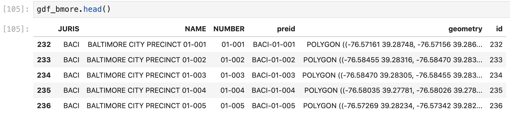
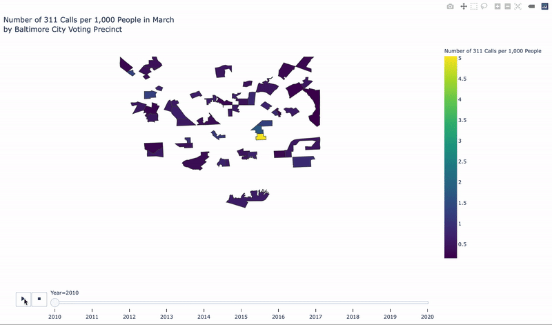

# Creating a Dynamic Choropleth Map Animation with Plotly Express

We'll create another choropleth map with plotly express so that we can look at the changes in 311 requests over the past 10 years and to view precinct-specific data by hovering over our maps. 

### Edit Shape Data for Plotly Express

Before we can use our shapefile data in plotly express we need to convert it to a **geoJSON** format. When we created our animated choropleth map earlier, we used a geospatial file that was already formatted as a geoJSON file \(in a URL\), however, our current geospatial data is in a shapefile that we've imported with geopandas. 


We convert this into a geoJSON format with: 

```python
# convert geopandas df to a geoJSON format
geojson_bmore_precincts = gdf_bmore.__geo_interface__
```

Here, we define our geoJSON file \(`geojson_bmore_precincts =`\) as the data in our Baltimore City voting precinct geopandas file \(`gdf_bmore`\) converted into a geoJSON format \(`.__geo_interface__`\), which looks like: 


This contains all of the same information as our geopandas dataframe, but formatted in different categories \(`'type', 'features', 'geometry'`\) that plotly express will read in to plot this geospatial data. Since plotly express uses the `'id'` parameter to identify the shape and match up our data to plot, we'll need to match up these `id` values with our dataframe data. To do this, we need to make another column in our Baltimore voting precinct shape dataframe that brings the row index \(row header\) values "into" the geodataframe:

```python
# make "id" for precincts based on index
gdf_bmore["id"] = gdf_bmore.index
```

Here we define a new column in the Baltimore geodataframe \(`gdf_bmore["id"] =`\) that contains the same values as our row headers/index \(`gdf_bmore.index`\). This gives us: 



If we merge these values with our 311 call/population dataframe, we can use the **id** column as our new "key" to connect the 311 Request and population data with the shapefile geoJSON file:

```python
# merge id value on 311 data
gdf_march_id = gdf_march_pop.merge(gdf_bmore[["NUMBER", "id"]], 
                                   on = "NUMBER")
```

Here we use the same technique that we used earlier to merge geodataframes \(`merge()`\). We merge the `NUMBER` and `id` columns in the Baltimore City shapefile data \(`gdf_bmore`\) onto the population dataframe that we edited earlier \(`gdf_march_pop`\) using the `NUMBER` column as the "key" column to join data. This gives us: 


Before we merge the 311 count and population data and then use this for our Plotly Express choropleth map, we need to convert the geodataframe into a regular dataframe data type:

```python
# convert precinct geodataframe to df
df_311_march_id = pd.DataFrame(gdf_march_id)
```

Here, we convert the geopandas geodataframe \(`gdf_march_id`\) into a pandas dataframe \(`pd.DataFrame()`\). This looks exactly the same as our geodataframe, but is now in a different format so that we can use this in our Plotly Express code \(this is analogous to converting values in a date column into a datetime format\):


### Create Animated Choropleth Map with Plotly Express

Now we can use the edited dataframe to create an animated choropleth map that shows the distribution of 311 Requests in Baltimore City voting districts during the month of March from 2010-2020:

```python
# make a choropleth map of 311 calls per voting district
choropleth_311_march = px.choropleth(df_311_march_id, # dataframe with data for choropleth
                                     geojson=geojson_bmore_precincts, # shape, geospatial data geojson
                                     locations="id", # column in geojson that denotes the shapes
                                     color='311_per1000', # column in df that denotes the color scale
                                     animation_group = "year",
                                     animation_frame = "year",
                                     hover_name = df_311_march_id["NUMBER"],
                                     hover_data = ["count"],
                                     color_continuous_scale= "Viridis", 
                                     labels={'311_per1000':'Number of 311 Calls per 1,000 People',
                                             "NUMBER": "Baltimore City Precinct Number",
                                             "year": "Year",
                                             "count" : "Number of 311 Calls"
                                            }, # renaming any columns used
                                     title = "Number of 311 Calls per 1,000 People in March<br>by Baltimore City Voting Precinct",
                                     category_orders = {"year": [2010, 2011, 2012, 2013, 2014, 2015, 2016, 2017, 2018, 2019, 2020]}
                                          
                          )
```

Which follows the [same format that we used to create the animated choropleth map](https://melanieshimano.gitbook.io/covid-19-critical-trend-data-visualizations/animated-choropleth-map/making-an-animated-choropleth-map-with-covid-19-case-data#building-the-animation) of number of COVID-19 cases per county from January-April 2020. Here we also need to define the order of our animation frames with `category_orders = {"year": [2010, 2011, 2012, 2013, 2014, 2015, 2016, 2017, 2018, 2019, 2020]}` to guarantee that our animation frames appear in the correct order. If you installed Anaconda with or are using Python 3.7 or higher, then you don't need to include this parameter. 

We also need to define a custom **scope** of our animation since our visual doesn't fall under the list of pre-set geospatial categories \(world, continents, or some counties\):

```python
# update the geospatial boundaries of our animation
choropleth_311_march.update_geos(fitbounds="geojson", visible=False)
```

Here we update the geospatial parameters of our visualization \(`choropleth_311_march.update_geos()`\) by defining the boundaries for our map as only the shapes in our geoJSON file \(`fitbounds = "geojson"`\) and removing the default "box" plot boundary \(`visible = False`\)--you can try this with `visible = True` to see why we might want to remove this. 

This gives us: 



We can also save this animation as an html file with: 

```python
# save animation as html
choropleth_311_march.write_html("bmore_311calls_voting_district.html")
```


If you're using Google Colab, you'll need to import the Google Colab library to download files from the notebook and then download the files with: 

```text
# import library to download files from colab
from google.colab import files
```

```text
# download html file
files.download("bmore_311calls_voting_district.html")
```


### Data Insights

The choropleth map with plotly express allows us to see how the number of 311 Requests per voting districts has changed over time, and it allows us to get more explicit information from each voting district in each year with hover data: 


Here we can see that the yellow voting district that we saw in the earlier choropleth map is Voting Precinct 04-001, which includes the Baltimore Inner Harbor, City Hall, and the Baltimore City government downtown campus. This might tell us that people who live closer to the downtown area are more civically engaged, or that many 311 requests are for Baltimore City-owned properties by Baltimore City government employees. 

We can also use this animation to see the difference between 311 Requests in 2018, 2019, and 2020, which can help us estimate the effects of COVID-19 on Baltimore City civic engagement and could help us estimate the level of voter engagement in 2020 elections. We would need to conduct additional analysis to make any conclusions, but from this animated map we can see: 

* The number of 311 Requests per 1,000 people for the month of March drops from about 1,600 in 2018, to about 1,200 in 2019, to about 800 in 2020. This is a significant drop in 311 Requests in 2020 in the middle of the COVID-19 outbreak and shelter-in-place orders. The sharp decline in 311 calls may be due to several factors including less people being outside in Baltimore to know about requests that they can make to 311, people being more busy with their entire work life and family at home as people switch to remote work and school schedules, or people relocating away from Baltimore City during the COVID-19 outbreak if they are working remotely, among other reasons. 
* The distribution of 311 Requests shifts from being concentrated in Voting Districts 25-007, 04-001, and 08-007 and the southwest portion of Baltimore City in 2019 to Voting Districts 04-001 and 08-007 and the entire southern half of Baltimore City in 2020. This might mean that citizens in the southwest section of Baltimore City are making less requests, that the citizens in the mid-south and southwest sections of Baltimore are making more requests, or a combination of these two scenarios.
* The data before 2014 is pretty scattered and doesn't encompass the entire city, which can't help us make any conclusive statements about 10-year trends in 311 data. 

**What else does this animated choropleth tell us about changes in civic engagement or the infrastructure of Baltimore City in general? How might the Baltimore City Board of Elections use this information to reallocate resources for election polls, voter registration, and 2020 Election planning in general? How might Baltimore City use this to better assess civic responsiveness to changes in policies related to the COVID-19 outbreak \(i.e. will people engage with and listen to local policy updates if they aren't as civically engaged in this era of social distancing\)?**


