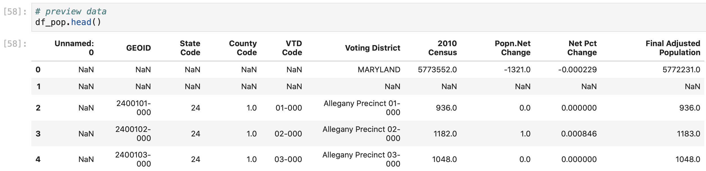
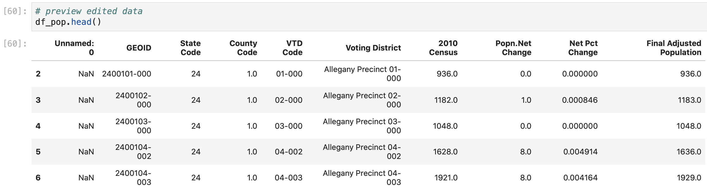
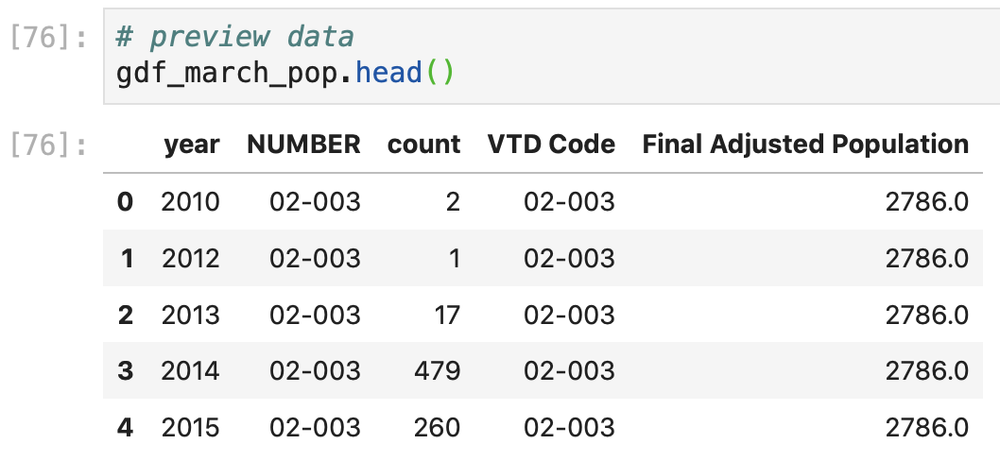
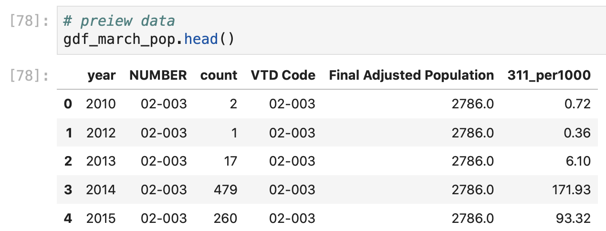
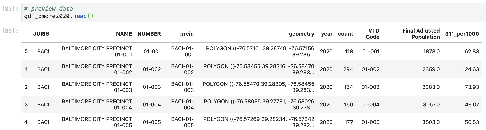
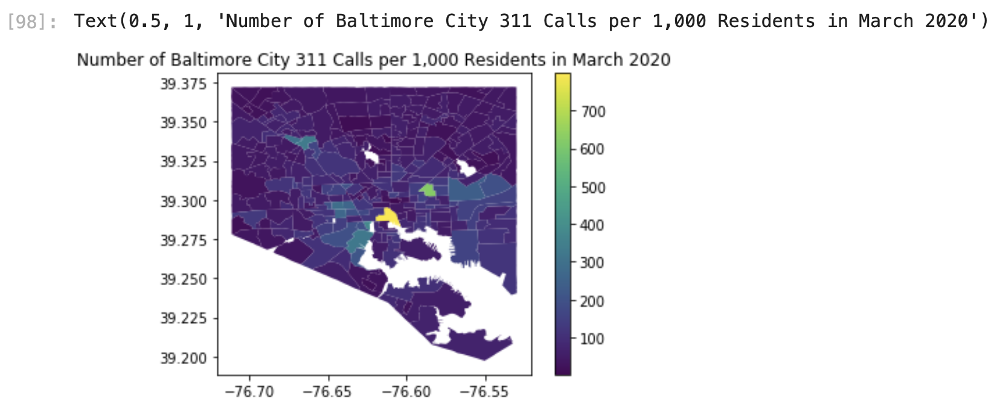

# Creating a Static Choropleth Map with Geopandas and Matplotlib

Now that we have a count for the number of 311 Requests per voting district, we can make a choropleth map to show how this varies in a data visualization. Before we can create a choropleth map, we need to bring in some additional data so that our choropleth map color values represent a standardized metric \(such as 311 calls per 1,000 people\) instead of an absolute number \(such as number of 311 calls\), which might represent the population distribution more than the percentage of civic engagement. 

Maryland doesn't regularly publish the population data at the voting precinct level, but we'll estimate the precinct population with data for all years from the Maryland Department of Planning's report of estimated voting precinct populations with 2010 census data. Baltimore's population has [decreased by about 27,000 people since 2010](https://www.census.gov/quickfacts/fact/table/baltimorecitymarylandcounty/AGE295218), so our population estimates won't be accurate, but they will give us a rough estimate about the distribution of citizens in different voting precincts. 

### Edit Baltimore City Population Data

You can download the raw data [here](https://planning.maryland.gov/Redistricting/Pages/2010/precinct.aspx) in the Appendix B-4: Adjusted 2010 Census Population Count In Pursuant To Maryland Law By Precinct/Voting District For Maryland Redistricting. We'll import this data with: 

```python
# import election precinct population data to normalize values for choropleth
df_pop = pd.read_excel("AppB4_Adj.xls", skiprows = 10)
```

Notice that we use the `skiprows` parameter here to "begin" our dataframe after the 10th row since these values in the Excel sheet are titles and headers that we don't need. This gives us a dataframe that looks like: 



The first two rows after our column headers give summary information for all of Maryland, which we can remove with: 

```python
# delete first two rows after column headers
df_pop = df_pop.drop(df_pop.index[0:2])
```

Here, we redefine the population dataframe \(`df_pop =`\) as the same values in the original population dataframe \(`df_pop`\) where we remove \(`.drop()`\) the rows that have a row index number \(row header; `df_pop.index`\) from 0 up to 2 \(`[0:2]`\). This gives us: 



The VTD Code \(Voting District Code\) in our population data set matches up with the voting district NUMBER in our voting precinct geodataframe, however, voting district numbers repeat for each county. If we merged our population data as is onto the voting district geodataframe, we'd have several matches for each VTD code, so we first need to filter our dataframe to include only values from Baltimore City: 

```python
# remove null values from voting population
df_pop = df_pop[df_pop["Voting District"].notnull()]

# keep only Baltimore City precinct rows
df_pop_bmore = df_pop[df_pop["Voting District"].str.startswith("Baltimore City")]
```

Here we first redefine the dataframe to remove any NaN/null values in the Voting District column \(`df_pop[df_pop["Voting District"].notnull()]`\). Then, we define a new dataframe \(`df_pop_bmore =`\) that only includes values from our population data \(`df_pop`\) when the values in the Voting District column \(`df_pop["Voting District"]`\) start with the words "Baltimore City" \(`.str.startswith("Baltimore City")`\) to only include Baltimore City voting district data. 

### Merge 311 Counts with Population Data

Now we can merge the voting district populations onto our 311 Request aggregated count  geodataframe with a geopandas `.merge()` function, which is slightly different than a pandas `.merge()` function: 

```python
# merge population data onto gdf_march2020
gdf_march_pop = gdf_march_agg.merge(df_pop_bmore[["VTD Code", "Final Adjusted Population"]], 
                                    left_on = "NUMBER", 
                                    right_on = "VTD Code")
```

Here we define a new geodataframe \(`gdf_march_pop =`\) that is our aggregated 311 count dataframe merged with \(`.merge()`\) the VTD Code column \(as the "key" column\) and the Final Adjusted Population column from our population dataframe \(`df_pop_bmore[["VTD Code", "Final Adjusted Population"]]`\). Here, our "left" dataframe is the first dataframe mentioned \(`gdf_march_agg`\), and our "right" dataframe is the second dataframe mentioned \(`df_pop_bmore`\). We merge the values in our new dataframe based on the key column called NUBMER from `gdf_march_agg` \(`left_on = "NUMBER"`\) and the key column called VTD Code from `df_pop_bmore` \(`right_on = "VTD Code"`\). This gives us: 



Since we want to standardize the number of call counts based on our estimated voting district population, we create a new column with this metric in our dataframe similar to how we calculated the number of COVID-19 cases per county in our [previous analysis](https://melanieshimano.gitbook.io/covid-19-critical-trend-data-visualizations/animated-choropleth-map/cleaning-nyt-covid-19-us-county-data#create-columns-for-cases-and-deaths-per-1-000-county-residents): 

```python
# calculate number of 311 calls per 1,000 people and round to 2 decimal places
gdf_march_pop["311_per1000"] = round(((gdf_march_pop["count"]/gdf_march_pop["Final Adjusted Population"])*1000),2)
```

Here, we create a new column in our merged dataframe \(`gdf_march_pop["311_per1000"] =`\) that contains the calculated result of the number of 311 calls in that voting precinct in that year \(`gdf_march_pop["count"]`\) divided by the number of people who live in that voting precinct \(`gdf_march_pop["Final Adjusted Population"]`\) to get the number of 311 calls per person. Then, we multiply these values by 1,000 to get the number of 311 calls per 1,000 people \(`*1000`\). We also use the round function \(`round(___, 2)`\) to round the result of this calculation to two decimal places to clean up our data. This gives us: 



### Edit 311 Data For Static Choropleth Map

Since we're first creating a static choropleth map, we can only include data from one year. We'll filter our data to include only data from 2020 with:

```python
# filter df to include 2020 data
# to make static choropleth map

gdf_march2020 = gdf_march_pop[gdf_march_pop["year"]==2020]
```

### Merge Standardized 311 Request Counts to Voting Precinct Shapes

Now, we can merge the 311 Request count per 1,000 residents data onto our geographic voting precinct shape data by merging the values based on the Baltimore City voting precinct number columns:

```python
# add aggregate data onto the geodataframe

gdf_bmore2020 = gdf_bmore.merge(gdf_march_pop, 
                                on = "NUMBER")
```

Here we use the same function and format to merge the geodataframes as we did to merge the population data onto the 311 aggregated count geodataframe. Since the "key" columns in both the population dataframe and the geospatial shape dataframe are both named NUMBER, we don't need to define the key column in both geodataframes, and can instead define one "key" column with `on = "NUMBER"`. 

This gives us a dataframe that contains both the geospatial shape data for Baltimore City voting precincts **and** the counts for 311 calls per 1,000 residents in the same geodataframe: 

```python

```



### Create Static Choropleth Map

Now we can use `matplotlib` to create a static choropleth map of our 311 call data. This is similar to the formatting that we used to create the wordcloud maps earlier: 

```python
# plot a static choropleth map

# define both the plot and the legend
fig, ax = plt.subplots(1, 1)
# plot map
gdf_bmore2020.plot(column="311_per1000", 
                   ax=ax, 
                   legend=True)

# add title
plt.title("Number of Baltimore City 311 Calls per 1,000 Residents in March 2020")
```

First, we define the layout of our map, which needs to include the actual map \(`fig`\) and the figure latitude and longitude axes \(`ax`\). Since we're only plotting one image out "subplots" make a single image, or a 1 x 1 matrix \(`plt.subplots(1,1)`\).

Then we define the values in our plot/map \(`gdf_bmore2020.plot()`\). Since geopandas has a pretty [robust interface with matplotlib](https://geopandas.org/mapping.html), we can make a map based on our geodataframe by simply defining the column in the geodataframe that contains the choropleth map value information \(`column = "311_per1000"`\). We also define the axis parameter to define the coordinates for our map \(`ax =ax`\), and we include the map legend so that we can tell what the colors in our choropleth map correspond to \(`legend = True`\). To make our map easier to undertand to our end user, we include a descriptive map title with `plt.title()`. This gives us:



This gives us a nice choropleth map that shows the distribution of 311 Requests made per Baltimore City voting precinct in March 2020. We see that the voting district highlighted in yellow has significantly more 311 requests than the other voting districts, and a couple clusters of voting districts in the southeast of Baltimore city and the middle south of Baltimore City have more 311 requests per resident than the rest of Baltimore. While this is useful to look at the distribution of citizen engagement at a high level, we don't know any specific information about the individual voting district precincts or the number of 311 calls.


