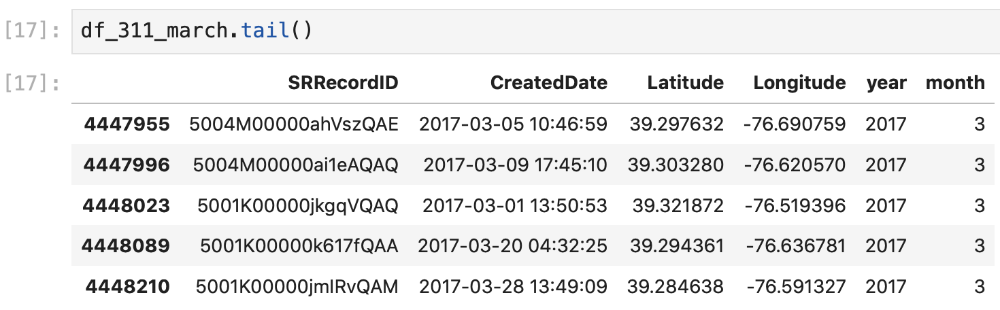

# Editing Baltimore City 311 Data

### Filter Dataframe for 311 Requests in March in Any Year

If we look at the data types in our data frame with `df_311.info()`, we see that all of the date columns are objects instead of datetime data types. We want to convert these to a _datetime_ data type so that we can extract the month and year to more easily filter our dataset:

```python
# convert created date to a datetime data type
df_311["CreatedDate"] = pd.to_datetime(df_311["CreatedDate"])
```

Here, we're redefining our `CreatedDate` column \(`df_311_filter["CreatedDate"]`\) as the same data in the `CreatedDate` column \(`df_311_filter["CreatedDate"]`\), but converted into a datetime data type \(`pd.to_datetime()`\). This might take a while to run since we're converting 4,448,357 dates into datetime data types. 

This gives us: 


Now, we can create two new columns to extract the month and year data from the `CreatedDate` so that we can easily filter the Request Calls from each year in March: 

```python
# create columns for month and year
df_311_filter["year"] = df_311_filter["CreatedDate"].dt.year
df_311_filter["month"] = df_311_filter["CreatedDate"].dt.month
```

Here we create a new column \(`df_311_filter["year"] =`\) that includes only the year \(`.dt.year`\) from the CreatedDate column \(`df_311_filter["CreatedDate"]` \), and another new column \(`df_311_filter["month"] =`\) that includes only the month \(`.dt.month`\) from the CreatedDate column \(`df_311_filter["CreatedDate"]` \). This gives us:


Which makes it easy for us to create a dataframe that only includes 311 Requests from the month of March \(month 3\) in any calendar year: 

```python
# keep only the data created in any year in march
df_311_march = df_311_filter[df_311_filter["month"]==3]
```

Here, we define a new data frame \(`df_311_march =`\) that contains only the data from our filtered 311 dataframe \(`df_311_filter[]`\) if the value in the month column is 3, which corresponds to March \(`df_311_filter["month"] ==3`\). Notice that we use the `==` to indicate "equals to"  and the `=` to indicate "defined as."

Now we have a data frame that only contains data from March for all 11 years of data available: 




