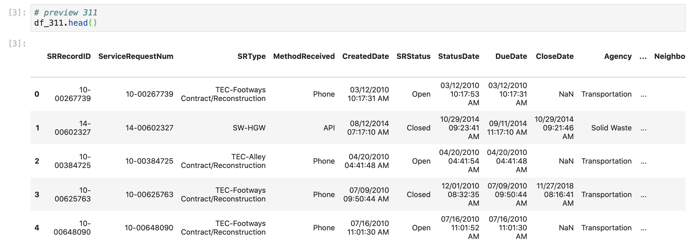
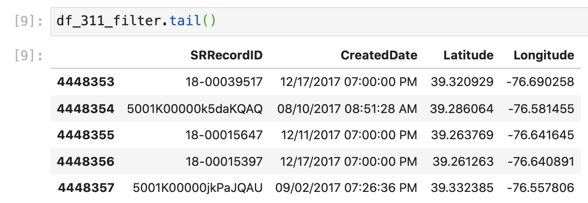

# Importing Packages and Data

We'll first import the packages and libraries that we'll use in our analysis: 

```python
# data analysis
import pandas as pd

# geospatial analysis
import geopandas as gpd
import json

# data visualization
import plotly.express as px
import matplotlib.pyplot as plt
%matplotlib inline
```

We'll use three different data sets for our analysis \(Baltimore City 311 Call data, Maryland Voting Precinct shape data, Baltimore City precinct population data\), but we'll import these as we need them so that we remember the data frame names. 

First, we'll import the Baltimore City 311 data, which we can download from the [Baltimore City Open Data portal](https://data.baltimorecity.gov/City-Services/311-Customer-Service-Requests/9agw-sxsr): 

```python
# import 311 data
# make sure to upload the file first if using colaboratory
df_311 = pd.read_csv("311_Customer_Service_Requests.csv")
```

You may get a warning message that tells you to use `low_memory = False`, but you can ignore this \(you'll still be able to import the data\). This is a depreciated error message, which you can read more about [here](https://github.com/pandas-dev/pandas/issues/5888), that occurs when you're working with a large dataset. Pandas needs to "guess" the data types inside of the dataframe, with can take a long time with larger datasets, so the default processing is set to `low_memory = True`, which essentially processes the data in chunks to use less memory. The `low_memory = False` is supposed to help when there are different data types in the dataframe, meaning that pandas could process each  of these data types individually, however, the dataframe will get processed regardless.


If you're using Google Colab, you'll need to upload your Baltimore City 311 Data to your local Google Colab files, which you can access on the left menu pictured below. Since this is a large file, uploading to Colab may take a while.



If we preview the data we get: 



This dataset contains a ton of information about the 311 Customer Service Requests, and you can read about the data in the columns [here under the Columns in this Dataset section](https://data.baltimorecity.gov/City-Services/311-Customer-Service-Requests/9agw-sxsr). For this analysis, we're mainly concerned with the date that the request was created and the location where it was created \(latitude and longitude coordinates\), since we're trying to measure civic engagement, not government operations productivity.

We'll edit our dataframe to include only the information that we want so that it'll be easier to understand how we want to aggregate and manipulate our data: 

```python
# filter dataframe
df_311_filter = df_311.filter(["SRRecordID", "CreatedDate", "Latitude", "Longitude"])
```

Here we define a new data frame \(`df_311_filter`\) that contains the same data as our initial data frame \(`df_311`\), but only includes \(`.filter()`\) the `SRRecordID`,`CreatedDate`, `Latitude`, `Longitude` columns. We keep the SRRecordID column so that we keep a unique identifier for each 311 Request in case we need to merge any manipulated data back to the original data. 

This gives us: 



