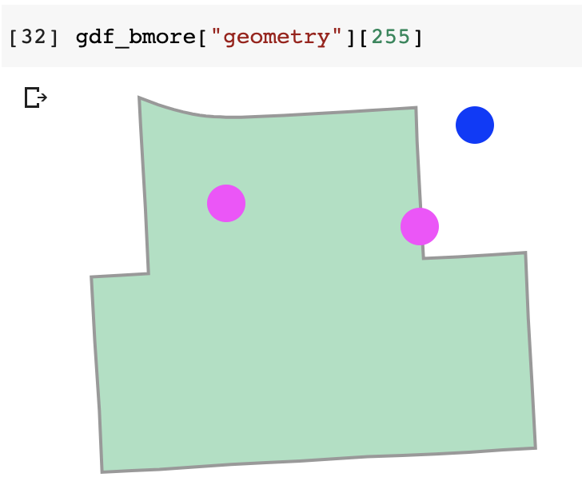

# Merging 311 Location Data with Baltimore City Voting Precinct District Data

### Convert 311 Location Data to Geospatial Format

Even though our 311 Request data includes latitude and longitude coordinates, we need to convert this into a geospatial data format in order to combine this with our geospatial voting district data, similar to how we needed to convert date/time values into a datetime data type before we can extract the month and year values. We'll use the`geopandas` package  to do this.

To convert our pandas dataframe into a geopandas geodataframe, we need to identify three parameters: 

* the data frame that contains geospatial data that we need to convert into a geospatial data format
* the Coordinate Reference System \(CRS\), which identifies how the coordinates map onto our geography \(analogous to labeling axes on a graph\). We worked with the Earth's latitude and longitude coordinate system previously, but there are also US-specific [state plane coordinate systems](https://www.usgs.gov/faqs/what-state-plane-coordinate-system-can-gps-provide-coordinates-these-values?qt-news_science_products=0#qt-news_science_products) among others. The European Petroleum Survey Group \([ESPG](http://www.epsg.org/)\) maintains a database of different coordinate systems and how they translate to each other.
* the data points/columns of data that will become the geographic points or shapes \(polygons\) in our geodataframe

To convert our 311 latitude and longitude data into a geodataframe we'll write: 

```python
# convert 311 march data into a geopandas dataframe
gdf_311_march = gpd.GeoDataFrame(df_311_march,
                                 crs = {'init': 'epsg:4326'},
                                 geometry=gpd.points_from_xy(df_311_march.Longitude,df_311_march.Latitude))
```

Here we define a new geodataframe \(`gdf_311_march =`\) in a geodataframe format with geopandas \(`gpd.GeoDataFrame()`\) using the values from our 311 data \(`df_311_march`\). We define the coordinate system as the Earth's coordinate system \(`crs = {'init': 'epsg:4326}`\) which is the EPSG code 4326. We define the geometry of the data as a list of the values from the longitude and latitude coordinates \(`df_311_march.Longitude,df_311_march.Latitude`\) that we convert into a Point geometry format \(`gpd.points_from_xy`\). Notice that we list the longitude coordinate first when defining the geospatial format. 

If we preview our data we see:


The geometry column is listed in the format `POINT (longitude, latitude)`. This means that each of the 311 Request Calls is now assigned to a coordinate that we can plot on a map or combine with another geodataframe. 

### Edit Voting District Geospatial Data

Since we want to estimate how civic engagement with respect to 311 Requests might affect voter engagement and turnout in the 2020 Election, we want to see how the number of 311 calls has changed in different voting districts. We'll use the voting district shapefile data from [this open source project](https://github.com/nvkelso/election-geodata). You can download the Maryland-specific geospatial data [here](https://github.com/nvkelso/election-geodata/tree/master/data/24-maryland/statewide/2016). Notice that when you unzip the shapefile data, it is a folder with seven different files:


While all of these are important to reconstruct any geospatial shapes \(e.g. you need to upload the entire zipped file to Mapbox if you are plotting shapes in their drag-and-drop interface\), we'll only need to use the `.shp` file to work in geopandas. 

We import this into our notebook with: 

```python
# import shape file with voting districts
gdf_md = gpd.read_file("md_2016_FEST/md_2016_w_ushouse.shp")
```


If you're using Google Colab, you'll need to upload all seven files from the unzipped file under your files tab.  


Note that our file pathname includes the file name \(`md_2016_FEST/`\) as well as the shapefile name. We only need to import the `.shp` file, but this import also accesses information from the other 6 files, so we need to make sure all of these are included in our working file.This is similar to how we import csv and Excel workbook data into our notebooks, but here, we're reading in the shapefile data. If we preview the geodataframe, we see a large dataframe: 


This includes data about all Maryland voting districts \(name, number, and geometry\) and the 2016 election results. Notice that the geometry column here is in the format `POLYGON ( (long, lat), (long, lat),...(long, lat))` to define all of the longitude and latitude points that make up the shape of that voting district. 

Since we don't need all of the 2016 Election data, we'll edit our data to only include information about the shapefiles: 

```python
# filter md gdf to precinct name, number and polygon
gdf_md = gdf_md.filter(["JURIS", "NAME", "NUMBER","preid", "geometry"])
```

Here, we filter the Maryland shapefile data \(`gdf_md.filter()`\) to only include the columns specified, which gives us: 


Since we're working with only Baltimore City 311 data, we can also filter our geodataframe to only include shape data from Baltimore City:

```python
# make gdf of only baltimore city voting precincts
gdf_bmore = gdf_md[gdf_md["JURIS"] == "BACI"]
```

Here, the `"BACI"` label in the jurisdiction column \(`gdf_md["JURIS"]`\) corresponds with Baltimore City. 

If we look closer at the coordinates in the geometry column, we notice that these don't look like our latitude and longitude coordinates in our 311 data, which over around \(39, -76\):


We need to convert these Maryland state coordinates to our Earth latitude and longitude coordinates: 

```python
# convert geometry to epsg 4326
gdf_bmore["geometry"] = gdf_bmore["geometry"].to_crs(epsg = 4326)
```

Here, we redefine the geometry column \(`gdf_bmore["geometry"] =`\) as the same data from the geometry column \(`gdf_bmore["geometry"]`\), but converted into the latitude and longitude Earth coordinates defined by the EPSG code 4326 \(`.to_crs(epsg = 4326)`\). This gives us coordinates that look like expected Baltimore coordinates: 


However, if we look at the CRS of this data, we see that the underlying data type hasn't changed: 

```python
# check CRS
gdf_bmore.crs
```

yields: `{'init' : 'epsg:26985'}`, which is obviously not EPSG code 4326. To convert this data to the proper underlying datatype, we redefine the geodataframe to define the CRS:

```python
# redefine baltimore polygons as a geopandas df to define coordinates
gdf_bmore = gpd.GeoDataFrame(gdf_bmore,
                                 crs = {'init': 'epsg:4326'},
                                 geometry= "geometry")
```

We use `gpd` exactly the same as when we defined the geodataframe with our 311 data earlier, but here we can directly call the geometry column as the geometry data \(`geometry = "geometry"`\) since it is already formatted as a POLYGON geospatial data type. If we preview this data, it will look exactly the same as before, but now `gdf_bmore.crs` yields `{'init' : 'epsg:4326'}`.

We can visualize what this data looks like by plotting the shapefile quickly with matplotlib \(the same library we used to plot word clouds\): 

```python
# plot voting district shapes
gdf_bmore.plot()
```

Which gives us a map that is segmented by voting districts: 


### Merge 311 Data with Voting District Data

Now that we have both the 311 and Voting District data formatted as geospatial data, we can conduct a _**spatial merge**_ ****to figure out which 311 data points are inside which voting districts. This is similar to our regular pandas dataframe merge in that we need define two dataframes \(usually a dataframe that contains POLYGON geometry and a dataframe that contains POINT geometry\) and then define _how_ to merge them through the merge parameters. 

#### Spatial Merge

We can [merge](https://geopandas.org/mergingdata.html) our spatial data in three ways: 

* **`intersects:`** this means that the values merge if the points intersect the boundary or interior of any of the shapes



* **`within:`** this means that the values merge if the points in are within the boundaries of the shapes


* **`contains:`** this means that the values merge if the shapes contain the points. 
  * This is essentially the same as `within` for our case, but this is different if we're merging two shapefiles. If at least one of the right shapefile points is within the shape of one of the left shapefile points, then it "contains" it. If the entire shape of the right shapefile shape is within the shape of one of the left shapefile shapes, then the right shape is "within" the left shape.

We can also define how we merge the spatial data similarly to **`how`** we merge pandas dataframes:

* **`left`** merges the values from the right geodataframe onto the left geodataframe. This keeps the row order and geometry of the **left dataframe**
* **`right`** merges the values from the left geodataframe onto the right geodataframe. This keeps the row order and geometry of the **right dataframe**
* **`inner`** merges the geodata and only keeps the values that intersect both dataframes. This keeps geometry of the **left dataframe**

To merge our 311 geospatial data with our Voting District geospatial data to associate a voting district ID with each 311 Request we write: 

```python
# assign each point to a voter precinct
gdf_311_inprecincts = gpd.sjoin(gdf_311_march, gdf_bmore,
                               how = "left",
                               op = "within")
```

This creates a new geodataframe \(`gdf_311_inprecincts =`\) that merges/spatially joins \(`gpd.sjoin()`\) the values of the 311 Request lat/long points \(`gdf_311_march`\) with the voting district shapes \(`gdf_bmore`\), This essentially assigns a shape/district to each 311 request if the point is within the shape \(`op = "within"`\), which means that each 311 request will remain in the dataset \(`how = "left"`\). This looks like: 


The voting district shape jurisdiction, name, number, and ID values have merged onto our 311 data. Now, we can aggregate the 311 data to count the number of 311 Calls in each voting district. We want to count the number of 311 Requests in each voting precinct in each year:

```python
# count the number of 311 requests per precinct per year

gdf_march_agg = gdf_311_inprecincts.groupby(["year", "NUMBER"])["SRRecordID"].agg(["count"]).reset_index()
```

 Here, we define a new geodataframe \(`gdf_march_agg =`\) that uses data from our merged 311/voter district data \(`gdf_311_inprecincts`\). We group the values first by year, and then by the voter district precinct number \(`.groupby(["year", "NUMBER"])`\) and then we count the number of unique 311 Requests in each of our voter precinct-year groups \(`.agg(["count"])`\). This essentially _aggregates_ the dataframe into a pivot table-like format where we might drag the year and NUMBER columns into the "rows" quadrant and the SRRecordID column into the "values" quadrant. The `.reset_index()` function resets our data frame so that both the year and NUMBER columns become columns again. Try creating the aggregated dataframe without the `.reset_index()` first to see why we use this.

This gives us a geodataframe that looks like: 


Which gives us the number of 311 calls for every voting precinct in every year for the months of March. 


